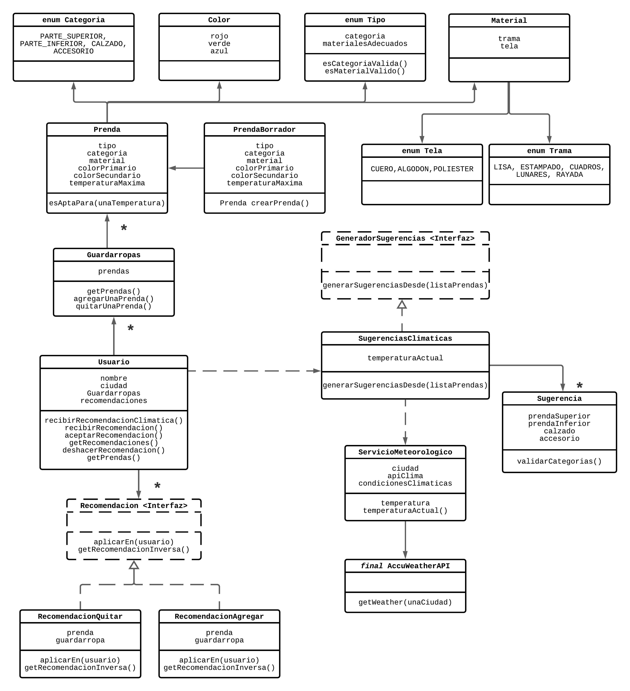

# Qué Me Pongo

_QuéMePongo es una empresa dedicada al armado de atuendos adecuados a las condiciones climáticas y preferencias de sus clientes. El servicio que provee se basa en tomar las prendas del guardarropas de une usuarie y generar diferentes combinaciones posibles que cubran las necesidades de les mismes en términos de distintos factores climáticos tales como temperatura, viento, sol, lluvia, etc. Asimismo, se busca que estos atuendos se adecuen de la mejor forma a las sensibilidades particulares respecto de dichos factores de cada usuarie y a sus gustos en el aspecto estético._

## Quinta Iteración

En esta iteración continuaremos trabajando sobre las sugerencias de atuendos:  
Como usuarie de QuéMePongo, quiero compartir mis guardarropas con otras personas. Por ahora, comenzaremos atacando los siguientes requerimientos específicos: 

1. Como usuarie de QuéMePongo, quiero poder manejar varios guardarropas para separar mis prendas según diversos criterios (ropa de viaje, ropa de entrecasa, etc). 
2. Como usuarie de QuéMePongo, quiero poder crear guardarropas compartidos con otros usuaries (ej, ropa que comparto con mi hermane). 
3. Como usuarie de QuéMePongo, quiero que otro usuario me proponga tentativamente agregar una prenda al guardarropas.
4. Como usuarie de QuéMePongo, quiero que otro usuario me proponga tentativamente quitar una prenda del guardarropas.
5. Como usuarie de QuéMePongo, necesito ver todas las propuestas de modificación (agregar o quitar prendas) del guardarropas y poder aceptarlas o rechazarlas..
6. Como usuarie de QuéMePongo, quiero poder deshacer las propuestas de modificación que haya aceptado.

# Diagrama de clases:


# Esta es una plantilla de proyecto diseñada para: 

* Java 8. :warning: Si bien el proyecto no lo limita explícitamente, el comando `mvn verify` no funcionará con versiones mas modernas de Java. 
* JUnit 5. :warning: La versión 5 de JUnit es la más nueva del framework y presenta algunas diferencias respecto a la versión "clásica" (JUnit 4). Para mayores detalles, ver: 
  *  [Apunte de herramientas](https://docs.google.com/document/d/1VYBey56M0UU6C0689hAClAvF9ILE6E7nKIuOqrRJnWQ/edit#heading=h.dnwhvummp994)
  *  [Entrada de Blog (en inglés)](https://www.baeldung.com/junit-5-migration) 
  *  [Entrada de Blog (en español)](https://www.paradigmadigital.com/dev/nos-espera-junit-5/)
* Maven 3.3 o superior

# Ejecutar tests

```
mvn test
```

# Validar el proyecto de forma exahustiva

```
mvn clean verify
```

Este comando hará lo siguiente:

 1. Ejecutará los tests
 2. Validará las convenciones de formato mediante checkstyle
 3. Detectará la presencia de (ciertos) code smells
 4. Validará la cobertura del proyecto

# Entrega del proyecto

Para entregar el proyecto, crear un tag llamado `entrega-final`. Es importante que antes de realizarlo se corra la validación
explicada en el punto anterior. Se recomienda hacerlo de la siguiente forma:

```
mvn clean verify && git tag entrega-final && git push origin HEAD --tags
```

# Configuración del IDE (IntelliJ)

 1. Tabular con dos espacios: 
 2. Instalar y configurar Checkstyle:
    1. Instalar el plugin https://plugins.jetbrains.com/plugin/1065-checkstyle-idea:
    2. Configurarlo activando los Checks de Google: 
 3. Usar fin de linea unix
    1. En **Settings/Preferences**, ir a a **Editor | Code Style**.
    2. En la lista **Line separator**, seleccionar `Unix and OS X (\n)`.
 
